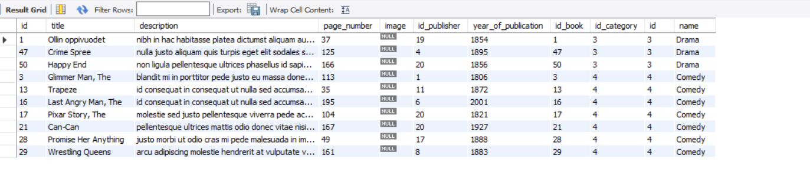
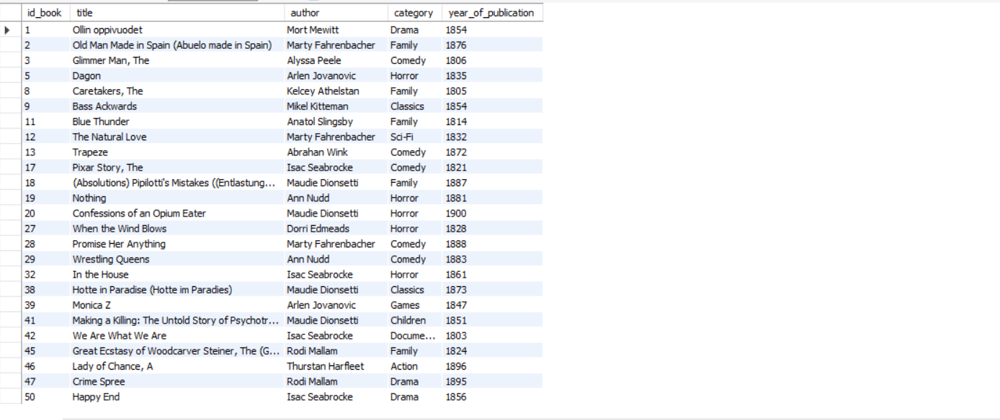
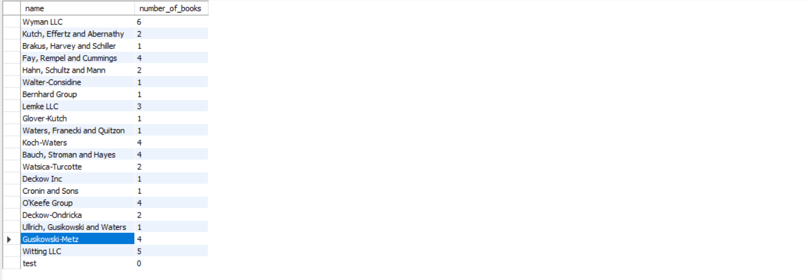

### Lấy ra thông tin tất cả các quyển sách thuộc thể loại comedy hoặc drama
```SQL
SELECT * 
FROM book b INNER JOIN book_category bc 
ON b.id = bc.id_book 
INNER JOIN category c 
ON c.id  = bc.id_category 
WHERE c.name LIKE 'comedy' 
OR c.name LIKE 'drama';
```



### Lấy ra id_book, title, author, category của quyển sách được xuất bản từ năm 1800 đến 1900
```SQL
SELECT b.id AS id_book, b.title , a.full_name AS author, c.name AS category, b.year_of_publication 
FROM book b INNER JOIN book_category bc 
ON b.id = bc.id_book 
INNER JOIN category c 
ON c.id  = bc.id_category
INNER JOIN book_author ba 
ON b.id = ba.id_book 
INNER JOIN author a 
ON a.id = ba.id_author 
WHERE b.year_of_publication >= 1800 
AND b.year_of_publication <= 1900;
```


### Đếm số sách dựa theo nhà xuất bản (Hiển thị tên nhà xuất bản và số sách thuộc nhà xuất bản đó)
```SQL
SELECT p.name , COUNT(b.id) AS  number_of_books
FROM book b RIGHT JOIN publisher p 
ON b.id_publisher = p.id 
GROUP BY p.id;
```
